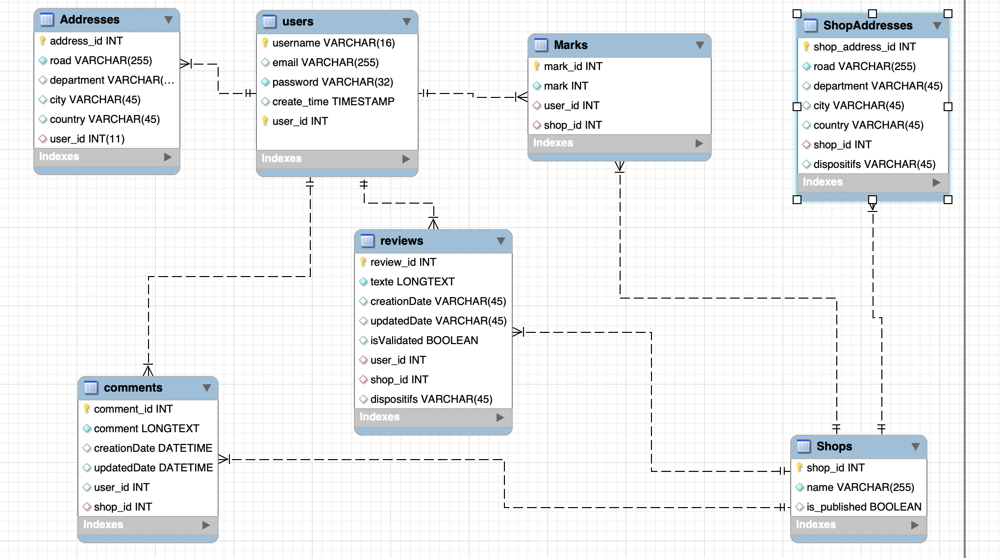

# Fiche Projet IDV-WEB4

## Point de Départ du Projet 

Après avoir entamé un travail totu à fait indépendant des quests du modules (quests 1 à 5) en suivant différents tutoriels, j'ai décidé aux alentours de l'étape 4 de repartir de la base de travail fournie par l'ETNA afin de vérifier mes compétences en y ajoutant le respect de certaines contraintes (type Quest 2=> JWT avec un fichier deja fourni).

Le point de départ de ce projet sera donc l'API à l'état de l'Etape 4(et non le react car le sujet a été affiné et demande un autre travail=> cf. Définition du projet).

Cette base connaîtra donc différents incréments, que vous pourrez suivre au travers de différentees branches de feat.

Elle connaîtra aussi des branches de Fix car on souhaite(dans la mesure du possible au niveau du temps) refacto le code en passant par des fonctions async, un découplage plus pertinent du code implémenté jusque-là(type Repositories, Interfaces), ce qui me permettra de comprendre les différentes complexités liées à un découplage d'un code préexistant.

Vendredi sera donc la date de release d'une **v1.0.0** dont vous retrouverez les détails ci-dessous.

## Définition du Projet

Ce projet, réalisé dans le cadre du module IDV-Web4, propose un service de réservation en restaurant s'adressant **aux personnes handicapées**(idée encore fraîche).

En effet, par le biais de cette application, un utilisateur inscrit pourra consulter tous les restaurants partenaires à cette app et mettant en place **des dispositifs dédiés aux handicapés**.

Cette application, dont le backend sera réalisé en .NET et le frontend en ReactJs, aura (en MVP tout du moins), aura différentes fonctionnalités que vous retrouverez ci-dessous et réparties par les rôles suivants(du moins permissif au plus permissif) : 

- **Anonyme** : Un utilisateur non connecté aura tout de même accès à quelques fonctionnalités
- **User** : Un utilisateur connecté pourra réserver dans un restaurant afin d'y manger à une heure précise
- **Boutique(Shop)** : (devrait être exporté dans un autre service mais OK en MVP) Un utilisateur avec le rôle boutique pourra se créer un compte en tant que propriétaire d'un restaurant et soumettre une demande de validation afin d'être accepté en tant que partenaire à l'application.  
- **Admin** : Un admin se verra donc octroyé toutes les fonctionnalités de l'User, en plus d'autres privilèges

## Fonctionnalités du Rôle Anonyme 

- Un utilisateur anonyme pourra voir la liste des restaurants mettant en place des dispositifs d'aide aux handicapés.
- Il pourra ainsi voir les détails d'un restaurant afin de savoir quels sont les dispositifs mis en place.
- Un utilisateur peut rechercher les restaurants dans sa ville/département mettant en place ces dispositifs.
- Un utilisateur anonyme pourra s'inscrire à l'application afin de devenir un utilisateur inscrit.
- Un utilisateur inscrit pourra se connecter à l'application afin de se voir octroyer le Rôle User.

## Fonctionnalités du Rôle User

 **Un utilisateur connecté pourra, dans un premier temps, avoir les différentes vues de l'utilisateur anonyme avec en plus des services supplémentaires:**
- Un utilisateur connecté pourra Enregistrer/Modifier/Supprimer une ou plusieurs adresses
- Il pourra voir/modifier/supprimer son propre profil
- Il pourra Ajouter/Modifier/Supprimer une note à un restaurant visité
- Il pourra Ajouter/Supprimer/Modifier Un commentaire à un restaurant.

## Fonctionnalités du Rôle Boutique(Shop)

 **Un utilisateur avec le rôle Boutique aura des permissions quelque peu spécifiques :**
- Il pourra s'inscrire à l'application.
- Il pourra se connecter à l'application.
- Il peut ajouter/modifier/supprimer différents dispositifs d'aides aux personnes handicapées mis en place dans sa boutique.
- Il devra impérativement attendre une validation de l'utilisateur pour être publié en tant que restaurant partenaire.
- Il pourra Modifier/Supprimer son profil de l'application.
- Il pourra ajouter des commentaires seulement sur le fil associé à sa boutique. 

## Fonctionnalités du Rôle Admin

**Un utilisateur Admin pourra, dans un premier temps, avoir les différentes vues de l'utilisateur avec en plus des services supplémentaires:**
- Il pourra voir la liste des utilisateurs inscrits ainsi que leur profil.
- Il pourra Modifier/Supprimer des utilisateurs.
- Il pourra Modifier/Supprimer les adresses des autres utilisateurs.
- Il pourra Ajouter/Modifier/Supprimer des restaurants.
- Il pourra Ajouter/Modifier/Supprimer des adresses d'un restaurant.
- Il pourra Modifier/Supprimer les commentaires sur des restaurants d'autres utilisateurs.
- Il pourra Supprimer la note d'un Utilisateur si et seulement s'il supprime l'utilisateur.
- Un admin pourra consulter toutes les demandes de validation de restaurants.
- Il pourra accepter/refuser l'ajout d'un restaurant à l'application.

## Schéma de l'architecture de la Base de Données (MySqlWorkbench)

Vous trouverez ci-dessous un schema non exhaustif(non intégralité des champs dont on n'a pas besoin pour les liaisons entre tables) de **la base de données de l'Application à sa v1.0.0** : 

- **Relations** : 

    -   **One To Many** : 
        -   Users/Marks
        -   Shops/Marks
        -   Users/Reviews
        -   Shops/Reviews
        -   Shops/ShopAddresses => Note importante : Découpage dès la v1 d'une nouvelle table ShopAddresses spécifiques aux adresses des restaurants dans un but de perf (à venir v2/v3).
        -   Users/Adresses
        -   Users/Commentaires
        -   Shops/Commentaires
